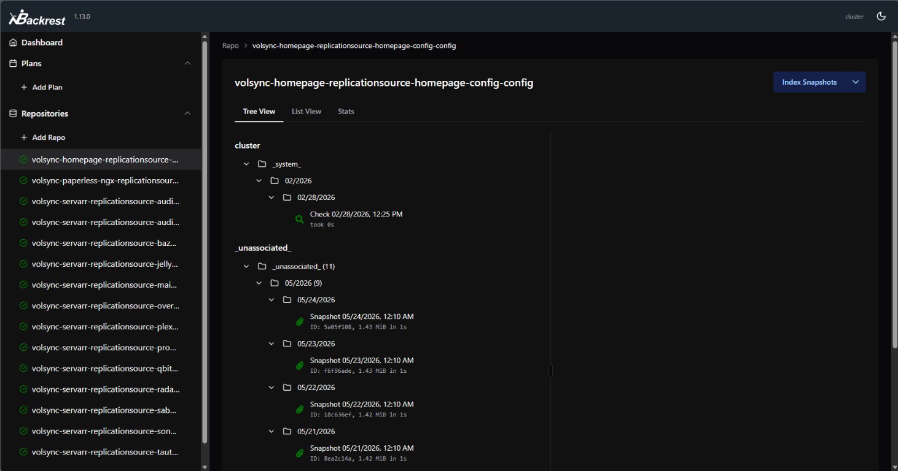
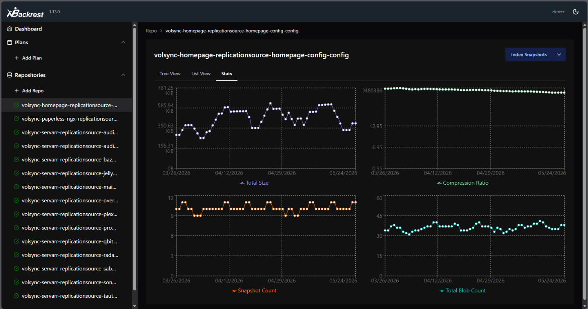

# backrest-volsync-operator (prototype)

Kubernetes operator that connects [VolSync](https://volsync.readthedocs.io/) [restic](https://restic.net/) repositories (`ReplicationSource`/`ReplicationDestination`) to a [Backrest](https://github.com/garethgeorge/backrest) instance.

## Prerequisites

- [VolSync](https://volsync.readthedocs.io/en/stable/installation/index.html) installed in the cluster with at least one `ReplicationSource` or `ReplicationDestination` using a restic repository.
- A running [Backrest](https://github.com/garethgeorge/backrest) instance reachable from within the cluster.

## What it does

- Watches `BackrestVolSyncBinding` resources and ensures the referenced [VolSync](https://volsync.readthedocs.io/) repository is registered/configured in [Backrest](https://github.com/garethgeorge/backrest).
- Optionally auto-creates managed bindings for VolSync objects when enabled via `BackrestVolSyncOperatorConfig`.

## What it does not

- Remove repositories from Backrest.
- Backrest authentication is untested.

## Custom Resources

- `BackrestVolSyncBinding` (`bvb`): binds one VolSync object to one Backrest repo.
- `BackrestVolSyncOperatorConfig`: optional operator-wide config (pause switch + auto-binding defaults/policy).

## Install (Helm)

The Helm chart is in `charts/backrest-volsync-operator`.

```sh
helm install backrest-volsync-operator ./charts/backrest-volsync-operator -n backups --create-namespace
```

To enable auto-binding, set `operatorConfig.create=true` and configure a default Backrest URL:

```sh
helm upgrade --install backrest-volsync-operator ./charts/backrest-volsync-operator -n backups \
	--set operatorConfig.create=true \
	--set operatorConfig.defaultBackrest.url=http://backrest.backups.svc:9898
```

## Usage

### Manual binding

Create a `BackrestVolSyncBinding` (example: `charts/backrest-volsync-operator/examples/backrestvolsyncbinding.yaml`).

To enqueue Backrest repo tasks after new ReplicationSource snapshots, set:

- `spec.repo.triggerTasksOnSnapshot: true`

When enabled, the operator queues `INDEX_SNAPSHOTS` then `STATS` once per new observed completion marker.

```sh
kubectl apply -f charts/backrest-volsync-operator/examples/backrestvolsyncbinding.yaml
```

### Auto-binding

1. Create a `BackrestVolSyncOperatorConfig` (example: `charts/backrest-volsync-operator/examples/operatorconfig.yaml`).
2. Set `spec.bindingGeneration.policy` to `Annotated` or `All`.
3. If using `Annotated`, add annotation `backrest.garethgeorge.com/binding="true"` to eligible VolSync objects.

## Screenshots

Example Backrest views after the operator has registered a VolSync repository and indexed its snapshots:

### Repository tree view



### Repository stats view



## Development

```sh
make test         # run unit tests
make lint         # run golangci-lint (skipped if not installed)
make docker-build # build the operator image
```

## Release automation

This repository uses Release Please to create releases, then publishes artifacts in the same workflow run:

- Image publish: `.github/workflows/release-please.yaml` calls `.github/workflows/ghcr-build-push.yaml` when the root release is created
- Helm chart publish: `.github/workflows/release-please.yaml` calls `.github/workflows/helm-chart-publish-oci.yaml` when the chart release is created

Tag-triggered workflows still exist for manual/standalone runs:

- Chart publish via tags: `.github/workflows/helm-chart-publish-oci.yaml` on tags like `chart-v0.2.1`
